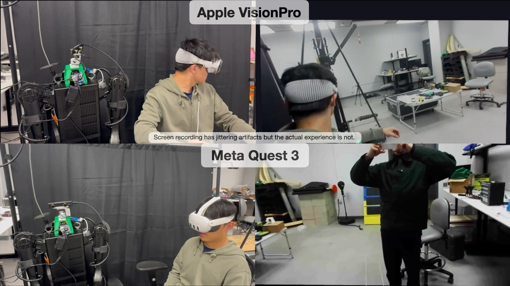

## 📺 Open-TeleVision: open-source tele-operation with vision 🤖
Xuxin Cheng*, Jialong Li*, Shiqi Yang, Ge Yang, 
Xiaolong Wang

UC San Diego, MIT

[Video](https://x.com/xuxin_cheng/status/1783838823849546067)

<p align="center">

</p>

## Introduction
Stream head, hand, wrist data from VisionPro or Meta Quest 3. Stream real-time stereo video from camera to VR Devices. 

## Installation

```bash
conda create -n tv python=3.8
conda activate tv
pip install 'vuer[all]==0.0.31rc7 opencv-python numpy'
```
Install zed sdk: https://www.stereolabs.com/developers/release/

## Local streaming
Apple does not allow WebXR on non-https connections. To test the application locally, we need to create a self-signed certificate and install it on the client. You need a ubuntu machine and a router. Connect the VisionPro and the ubuntu machine to the same router. 
1. install mkcert: https://github.com/FiloSottile/mkcert
2. check local ip address: 

```
ifconfig | grep inet
```
Suppose the local ip address of the ubuntu machine is `192.168.8.102`.

3. create certificate: 

```
mkcert -install && mkcert -cert-file cert.pem -key-file key.pem 192.168.8.102 localhost 127.0.0.1
```

4. open firewall on server
```
sudo iptables -A INPUT -p tcp --dport 8012 -j ACCEPT
sudo iptables-save
sudo iptables -L
```
or can be done with `ufw`:
```
sudo ufw allow 8012
```
5.
```python
self.app = Vuer(host='0.0.0.0', cert="./cert.pem", key="./key.pem")
```

6. install ca-certificates on VisionPro
```
mkcert -CAROOT
```
Copy the rootCA.pem via AirDrop to VisionPro and install it.

Settings > General > About > Certificate Trust Settings. Under "Enable full trust for root certificates", turn on trust for the certificate.

settings > Apps > Safari > Advanced > Feature Flags > Enable WebXR Related Features

7. open the browser on Safari on VisionPro and go to `https://192.168.8.102:8012?ws=wss://192.168.8.102:8012`

8. Click `Enter VR` and ``Allow`` to start the VR session.

## Network Streaming
For Meta Quest3, installation of the certificate is not trivial. We need to use a network streaming solution. We use `ngrok` to create a secure tunnel to the server. This method will work for both VisionPro and Meta Quest3.

1. Install ngrok: https://ngrok.com/download
2. Run ngrok
```
ngrok http 8012
```
3. Copy the https address and open the browser on Meta Quest3 and go to the address.

## Citation
```
@misc{cheng2022open,
  title={Open-TeleVision: open-source tele-operation with vision},
  author={Cheng, Xuxin and Li, Jialong and Yang, Shiqi and Yang, Ge and Wang, Xiaolong},
  year={2024}
}
```