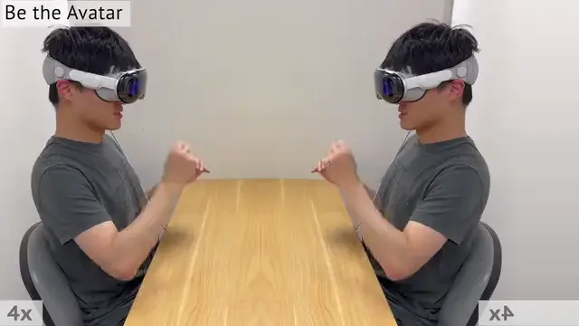

<h1 align="center"> Open-TeleVision: Teleoperation with

Immersive Active Visual Feedback</h1>

<p align="center">
    <a href="https://chengxuxin.github.io/"><strong>Xuxin Cheng*</strong></a>
    ·
    <a href=""><strong>Jialong Li*</strong></a>
    ·
    <a href="https://aaronyang1223.github.io/"><strong>Shiqi Yang</strong></a>
    <br>
    <a href="https://www.episodeyang.com/"><strong>Ge Yang</strong></a>
    ·
    <a href="https://xiaolonw.github.io/"><strong>Xiaolong Wang</strong></a>
</p>

<p align="center">
     &nbsp; &nbsp; &nbsp; &nbsp; &nbsp; &nbsp; &nbsp; &nbsp; &nbsp; &nbsp;
    
</p>

<p align="center">
<h3 align="center"><a href="https://robot-tv.github.io/">Website</a> | <a href="https://arxiv.org/abs/2407.01512/">arXiv</a> | <a href="">Video</a> | <a href="">Summary</a> </h3>
  <div align="center"></div>
</p>

<p align="center">

</p>

## Introduction
This code contains implementation for teleoperation and imitation learning of Open-TeleVision.

## Installation

```bash
    conda create -n tv python=3.8
    conda activate tv
    pip install -r requirements.txt
    cd act/detr && pip install -e .
```

Install ZED sdk: https://www.stereolabs.com/developers/release/

Install ZED Python API:
```
    cd /usr/local/zed/ && python get_python_api.py
```

If you want to try teleoperation example in a simulated environment (teleop_hand.py):

Install Isaac Gym: https://developer.nvidia.com/isaac-gym/

## Teleoperation Guide

### Local streaming
For **Quest** local streaming, follow [this](https://github.com/OpenTeleVision/TeleVision/issues/12#issue-2401541144) issue.

**Apple** does not allow WebXR on non-https connections. To test the application locally, we need to create a self-signed certificate and install it on the client. You need a ubuntu machine and a router. Connect the VisionPro and the ubuntu machine to the same router. 
1. install mkcert: https://github.com/FiloSottile/mkcert
2. check local ip address: 

```
    ifconfig | grep inet
```
Suppose the local ip address of the ubuntu machine is `192.168.8.102`.

3. create certificate: 

```
    mkcert -install && mkcert -cert-file cert.pem -key-file key.pem 192.168.8.102 localhost 127.0.0.1
```
ps. place the generated `cert.pem` and `key.pem` files in `teleop`.

4. open firewall on server
```
    sudo iptables -A INPUT -p tcp --dport 8012 -j ACCEPT
    sudo iptables-save
    sudo iptables -L
```
or can be done with `ufw`:
```
    sudo ufw allow 8012
```
5.
```
    self.app = Vuer(host='0.0.0.0', cert="./cert.pem", key="./key.pem")
```

6. install ca-certificates on VisionPro
```
    mkcert -CAROOT
```
Copy the rootCA.pem via AirDrop to VisionPro and install it.

Settings > General > About > Certificate Trust Settings. Under "Enable full trust for root certificates", turn on trust for the certificate.

settings > Apps > Safari > Advanced > Feature Flags > Enable WebXR Related Features

7. open the browser on Safari on VisionPro and go to `https://192.168.8.102:8012?ws=wss://192.168.8.102:8012`

8. Click `Enter VR` and ``Allow`` to start the VR session.

### Network Streaming
For Meta Quest3, installation of the certificate is not trivial. We need to use a network streaming solution. We use `ngrok` to create a secure tunnel to the server. This method will work for both VisionPro and Meta Quest3.

1. Install ngrok: https://ngrok.com/download
2. Run ngrok
```
    ngrok http 8012
```
3. Copy the https address and open the browser on Meta Quest3 and go to the address.

ps. When using ngrok for network streaming, remember to call `OpenTeleVision` with:
```
    self.tv = OpenTeleVision(self.resolution_cropped, self.shm.name, image_queue, toggle_streaming, ngrok=True)
```

### Simulation Teleoperation Example
1. After setup up streaming with either local or network streaming following the above instructions, you can try teleoperating two robot hands in Issac Gym:
```
    cd teleop && python teleop_hand.py
```
2. Go to your vuer site on VisionPro, click `Enter VR` and ``Allow`` to enter immersive environment.

3. See your hands in 3D!


## Training Guide
1. Download dataset from https://drive.google.com/drive/folders/11WO96mUMjmxRo9Hpvm4ADz7THuuGNEMY?usp=sharing.

2. Place the downloaded dataset in ``data/recordings/``.

3. Process the specified dataset for training using ``scripts/post_process.py``.

4. You can verify the image and action sequences of a specific episode in the dataset using ``scripts/replay_demo.py``.

5. To train ACT, run:
```
    python imitate_episodes.py --policy_class ACT --kl_weight 10 --chunk_size 60 --hidden_dim 512 --batch_size 45 --dim_feedforward 3200 --num_epochs 50000 --lr 5e-5 --seed 0 --taskid 00 --exptid 01-sample-expt
```

6. After training, save jit for the desired checkpoint:
```
    python imitate_episodes.py --policy_class ACT --kl_weight 10 --chunk_size 60 --hidden_dim 512 --batch_size 45 --dim_feedforward 3200 --num_epochs 50000 --lr 5e-5 --seed 0 --taskid 00 --exptid 01-sample-expt\
                               --save_jit --resume_ckpt 25000
```

7. You can visualize the trained policy with inputs from dataset using ``scripts/deploy_sim.py``, example usage:
```
    python deploy_sim.py --taskid 00 --exptid 01 --resume_ckpt 25000
```

## Citation
```
@article{cheng2024tv,
title={Open-TeleVision: Teleoperation with Immersive Active Visual Feedback},
author={Cheng, Xuxin and Li, Jialong and Yang, Shiqi and Yang, Ge and Wang, Xiaolong},
journal={arXiv preprint arXiv:2407.01512},
year={2024}
}
```
